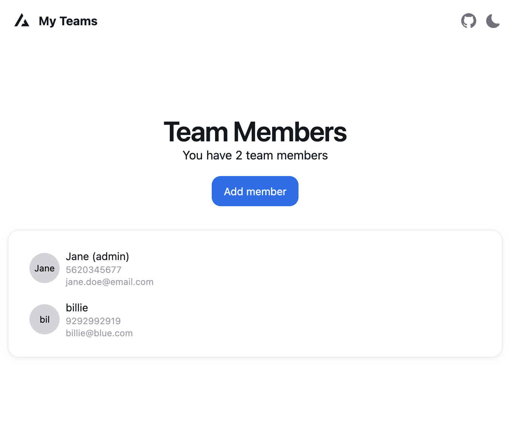

# My Teams App - Frontend

A simple React-based frontend for managing team members.  
Users can view, add, edit, and delete members through a user-friendly interface. This app communicates with a Django REST API backend.




## Technologies Used

- [Vite](https://vitejs.dev/guide/)
- [HeroUI](https://heroui.com)
- [Tailwind CSS](https://tailwindcss.com)
- [Tailwind Variants](https://tailwind-variants.org)
- [TypeScript](https://www.typescriptlang.org)
- [Framer Motion](https://www.framer.com/motion)
- [Formik](https://formik.org)


## Pre-requisites

Make sure you have the following installed:

- [Node.js](https://nodejs.org/) (v18+ recommended)
- [Yarn](https://yarnpkg.com/) or [npm](https://www.npmjs.com/)
- [Git](https://git-scm.com/)

## How to Use

To clone the project, run the following command:

```bash
git clone https://github.com/FaaCloack/my-teams-app.git
```

This will clone both the API and the Web APP projects. 
The Frontend one will be under the `my-teams` folder

### Install dependencies
Within the project folder, run the following command to install the dependencies

```bash
cd my-teams
yarn install
```

## Configuration

Set your API URL in a `.env` file in the project root:

```env
VITE_API_URL=http://localhost:8000/api/
```

### Run the development server

```bash
yarn dev
```
