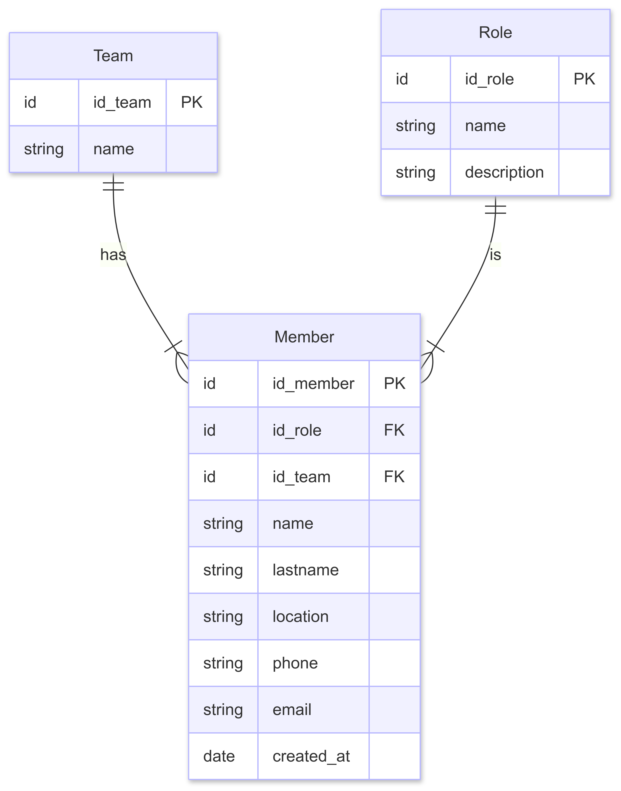

# My Teams API - Backend

A backend service built with Django and Django REST Framework to manage team members. It provides endpoints to **list**, **create**, **update**, and **delete** members and their associated teams and roles.


## Pre-requisites

Make sure you have the following installed:

- [Python](https://www.python.org) (3.10+ recommended)
- [pip](https://pypi.org/project/pip/)
- [Git](https://git-scm.com/)

## How to Use

To clone the project, run the following command:

```bash
git clone https://github.com/FaaCloack/my-teams-app.git
```

This will clone both the API and the Web APP projects. 
The Backend one will be under the `my_teams_backend` folder

### Create and activate a virtual environment
Within the project folder, create a virtual environment:

```bash
cd my_teams_backend
python -m venv venv
source venv/bin/activate  # On Windows: venv\Scripts\activate
```

### Install dependencies
Run the following command to install the dependencies

```bash
pip install -r requirements.txt
```

## Configuration

Set your Web App origin in a `.env` file in the project at the level of the `settings.py` file:

```env
CORS_ALLOWED_ORIGINS=http://127.0.0.1:5173,http://localhost:5173
```

### Run the development server
If its your first time running the project, you must apply the migrations before running the server.

```bash
python manage.py migrate # Apply migrations
python manage.py runserver
```

## API Endpoints

| Method | Endpoint        | Description         |
| ------ | --------------- | ------------------- |
| GET    | `/members/`     | List all members    |
| POST   | `/members/`     | Create a new member |
| GET    | `/members/:id/` | Get member detail   |
| PATCH  | `/members/:id/` | Update a member     |
| DELETE | `/members/:id/` | Delete a member     |


## Database ER Diagram
